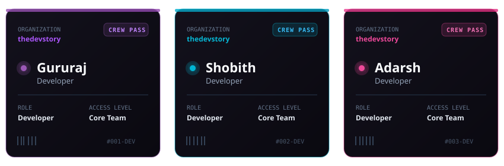

  <picture>
    <source media="(prefers-color-scheme: dark)" srcset="assets/header-banner.svg#gh-dark-mode-only">
    <source media="(prefers-color-scheme: light)" srcset="assets/header-banner-light.svg#gh-light-mode-only">
    
  </picture>

  
  
  

  

  <h2>🌌 Company Core Principles</h2>

At **thedevstory**, all tools we craft follow our studio-wide standards:
- ⚡ **Zero-Friction Tools**: Fast, intuitive web tools built without mandatory accounts or intrusive paywalls.
- 🔒 **Privacy by Architecture**: Client-side execution where user data remains strictly on your local device.
- 🎯 **Thoughtful Craftsmanship**: Lightweight interfaces designed to respect your time and attention.

---

  <h2>🚀 Products & Applications</h2>

> *Note: Each product built by **thedevstory** maintains its own dedicated feature set tailored to its specific domain.*

  <h3>💳 Splito — Split Bills Effortlessly <i>(Product #1 — Active)</i></h3>
  
<i>Split bills with friends — no sign-ups, no servers, no fuss.</i>

A free, lightweight web application designed for group expense splitting right inside your browser.

#### 🛠️ Splito-Specific Features:
- 🆓 **Free Forever**: 100% free with zero paywalls.
- 📶 **Works Offline**: Full PWA functionality running client-side without active internet.
- 🔑 **No Login Needed**: Start splitting expenses instantly without creating an account.
- 🛡️ **Privacy-First (No Data Sent)**: Your expense data never leaves your device. Ever.
- ⚙️ **No Backend Server**: All expense logic is calculated in your browser's local memory.

 

  <a href="https://splitoh.netlify.app" target="_blank" rel="noopener noreferrer">
    <picture>
      <source media="(prefers-color-scheme: dark)" srcset="assets/btn-launch-splito-dark.svg#gh-dark-mode-only">
      <source media="(prefers-color-scheme: light)" srcset="assets/btn-launch-splito-light.svg#gh-light-mode-only">
      
    </picture>
  </a>

 

---

  <h3>🛰️ Upcoming Products <i>(In Concept / Development)</i></h3>

Our studio is actively planning and developing future privacy-first tools. Each upcoming application will feature its own tailored architecture and capabilities.

---

  <h2>👨‍💻 The Crew</h2>

  <picture>
    <source media="(prefers-color-scheme: dark)" srcset="assets/crew-cards-dark.svg#gh-dark-mode-only">
    <source media="(prefers-color-scheme: light)" srcset="assets/crew-cards-light.svg#gh-light-mode-only">
    
  </picture>

---

  <h2>📬 Get In Touch</h2>

Got feedback, project inquiries, or feature ideas? Drop us a line!

- 📧 **Direct Email**: [thedevstory26@gmail.com](mailto:thedevstory26@gmail.com)
- 💬 **Web Form**: Submit messages directly through our website contact form.

---

  <h2>🌐 Connect With Us</h2>

  <picture>
    <source media="(prefers-color-scheme: dark)" srcset="assets/social-cards-dark.svg#gh-dark-mode-only">
    <source media="(prefers-color-scheme: light)" srcset="assets/social-cards-light.svg#gh-light-mode-only">
    
  </picture>

 

  

  &copy; 2026 <b>The Dev Story</b>. Built with passion for clean software.

