<div align="center">

<!-- Theme Adaptive Logo (Switches automatically between Dark and Light mode logos) -->
<picture>
  <source media="(prefers-color-scheme: dark)" srcset="assets/logo.svg#gh-dark-mode-only">
  <source media="(prefers-color-scheme: light)" srcset="assets/logo-light.svg#gh-light-mode-only">
  
</picture>

# the**dev**story


### *we build things that matter*

A small studio building lightweight tools respecting your time, your data, and your privacy.

<br/>

[](https://splitoh.netlify.app)
[](https://splitoh.netlify.app)
[](#-our-philosophy)

</div>

<br/>

<p align="center">
  
</p>

<p align="center">
  
</p>

## 🌌 Our Philosophy

At **thedevstory**, we believe modern web tools should be fast, private, and serverless whenever possible.
- ⚡ **No Sign-ups Required**: Use our tools instantly without creating accounts.
- 🔒 **No Data Harvesting**: Your data stays strictly on your local device.
- 🎯 **Zero Friction**: Lightweight interfaces optimized for mobile and desktop.

---

## 🚀 Featured Product

### 💳 **Splito** — Split Bills Effortlessly
> *Split bills with friends — no sign-ups, no servers, no fuss.*

A free, lightweight web application that works right in your browser, even offline. Your data never leaves your device. Ever.

```
┌─────────────────────────────────────────────────────────────┐
│                      SPLITO FEATURES                        │
├─────────────────┬─────────────────┬─────────────────────────┤
│  Free Forever   │  Works Offline  │     No Login Needed     │
├─────────────────┴─────────────────┴─────────────────────────┤
│          Privacy-First   •   No Backend Required            │
└─────────────────────────────────────────────────────────────┘
```

👉 **[Try Splito Live App (splitoh.netlify.app)](https://splitoh.netlify.app)**

---

## 👨‍💻 The Crew

Our core engineering team building thoughtful software:

| Member | Role | Organization Access |
| :--- | :--- | :--- |
| 🛠️ **Gururaj** | Developer | Core Team |
| ⚡ **Shobith** | Developer | Core Team |
| 🎨 **Adarsh** | Developer | Core Team |

---

## 📬 Get In Touch

Got a project in mind, feedback, or want to collaborate? Drop us a line!

- 📧 **Direct Email**: [thedevstory26@gmail.com](mailto:thedevstory26@gmail.com)
- 💬 **Feedback**: Submit messages directly via our web form.

---

## 🌐 Connect With Us

<div align="center">

<a href="https://www.github.com/"></a>
<a href="https://linkedin.com/"></a>
<a href="https://www.instagram.com/"></a>
<a href="https://youtube.com/"></a>

<br/><br/>


<sub>&copy; 2026 **The Dev Story**. Built with passion for clean software.</sub>

</div>
